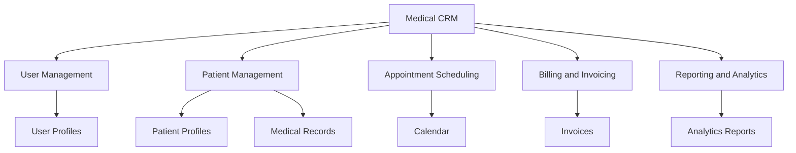

```mermaid
graph TD;
  A[Medical CRM] --> B[User Management];
  A --> C[Patient Management];
  A --> D[Appointment Scheduling];
  A --> E[Billing and Invoicing];
  A --> F[Reporting and Analytics];
  B --> G[User Profiles];
  C --> H[Patient Profiles];
  C --> I[Medical Records];
  D --> J[Calendar];
  E --> K[Invoices];
  F --> L[Analytics Reports];
```