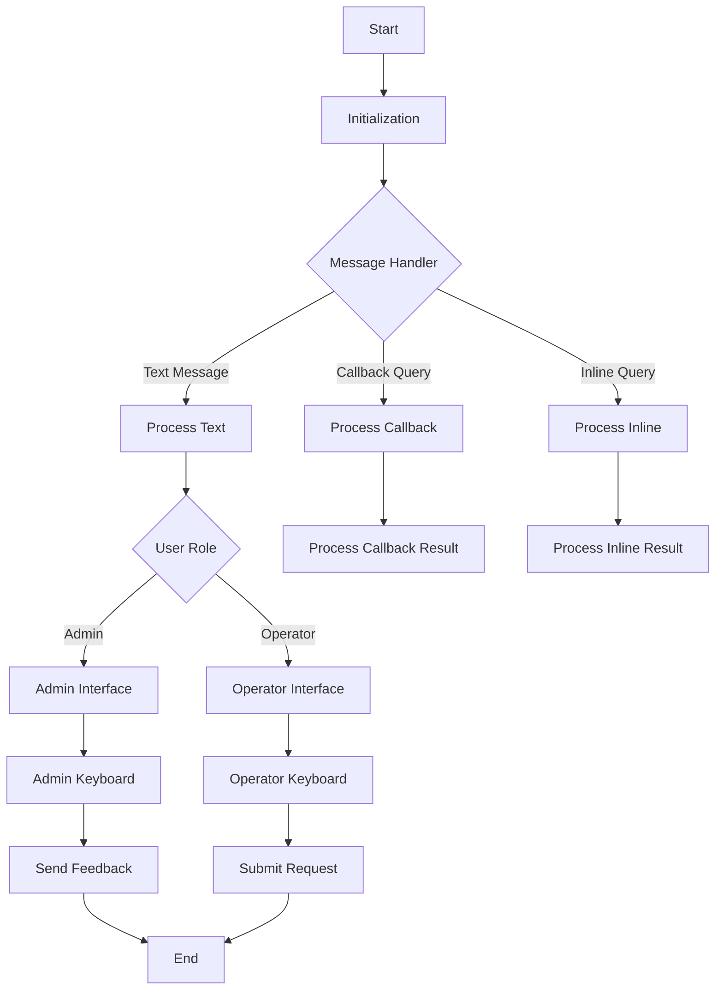

# BOT_ARCHITECTURE

## Telegram Bot Architecture

This document outlines the architecture of the Telegram bot used in the AutoMedCRM application, including its initialization, message handling, user roles, and keyboard interfaces.

### Overview
The Telegram bot is built to manage interactions between users and the AutoMedCRM system efficiently. The diagram below showcases the entire architecture.

### Components
1. **Bot Initialization**: Initializes the bot and sets up necessary configurations.
2. **Message Handlers**: Captures and processes different types of messages received from users.
3. **User Roles**: Determines whether the user is an admin or operator and directs them to the appropriate interface.
4. **Keyboard Interfaces**: Provides the respective keyboards for the admin and operator for easy access to functionalities.

### User Roles
- **Admin**: Has full control over the bot, able to manage settings and user queries.
- **Operator**: Limited access to handle user inquiries and support requests.

### Conclusion
Understanding the bot architecture is crucial for maintaining and enhancing the functionality of the bot within the AutoMedCRM application.